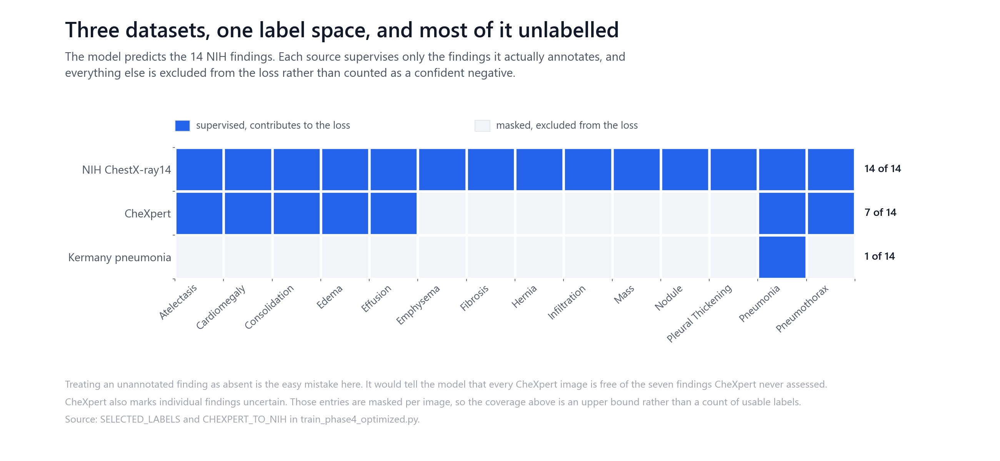
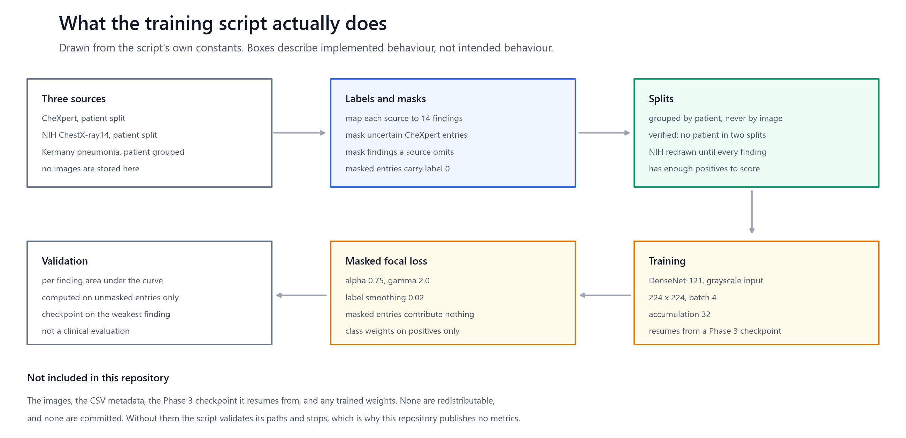

# Medico: chest X-ray multi-label training

A research training script that fine-tunes a DenseNet-121 across the 14 NIH chest
X-ray findings, learning from three datasets that label different subsets of them.

## Scope, stated first

This is experimental research code. It is not a clinical product, it has not been
clinically validated, and it must not be used for diagnosis, triage, treatment
decisions or any other clinical purpose.

No trained weights, patient data or held-out metrics are included here, so this
repository publishes no performance numbers. There are no result figures below
for the same reason: a score this repository cannot produce is not worth drawing.

## The problem it explores

Three public chest X-ray datasets annotate overlapping but different findings.
NIH ChestX-ray14 labels all 14. CheXpert labels 7 of them, and marks some of
those uncertain. The Kermany pneumonia set labels 1.

The naive way to combine them is to treat an unlabelled finding as absent. That
tells the model every CheXpert image is free of the seven findings CheXpert never
assessed, which is false for a large share of them, and the model learns it.



The approach here is to carry a mask alongside every label. A finding a source
does not annotate, and a finding CheXpert marks uncertain, contributes nothing to
the loss and nothing to the metrics for that image.

## What the script does



Fine-tunes DenseNet-121 with a grayscale input stem, resuming from a Phase 3
checkpoint. The loss is a masked focal loss with label smoothing, class weights
applied to positives only, and masked entries excluded from both the loss and its
normalisation.

## Patient splits

Several images of one person are normal in a chest X-ray dataset. Splitting over
images rather than people puts the same patient on both sides, and the resulting
score measures memorisation as much as generalisation.

All three splits are grouped by patient. CheXpert and NIH publish an identifier.
The Kermany pneumonia set does not, but its filenames carry one, and that is
recovered rather than ignored.

**This was not previously true.** The pneumonia split stratified by class alone
and had no notion of a patient, so images of one person could land in both
training and evaluation. `docs/splits-and-leakage.md` records what was found, the
fix, and what the fix does not cover. The training script now verifies all three
splits and stops rather than training on a leaking one.

## Data and permissions

Download the datasets from their owners and comply with their licences, access
terms, privacy requirements and any institutional approvals. Do not commit images,
CSV metadata, checkpoints or logs to this repository.

Expected local layout:

```text
data/
  chexpert/train.csv
  nih/Data_Entry_2017.csv
  nih/images/images/
  pneumonia/train/{NORMAL,PNEUMONIA}/
  pneumonia/test/{NORMAL,PNEUMONIA}/
checkpoints_phase3_fulldata/best_model_phase3_fulldata.pt
```

The Phase 3 checkpoint is required and is intentionally not tracked. Establish its
provenance and compatibility before a run.

## Running it

```bash
python -m venv .venv
.venv\Scripts\activate
pip install -r requirements.txt
```

Point the script at your data when it does not use the layout above:

```powershell
$env:MEDICO_DATA_DIR = "D:\medical-data"
$env:PHASE3_DIR = "D:\models\phase3"
python train_phase4_optimized.py
```

`CHEXPERT_ROOT`, `NIH_IMAGE_DIR`, `NIH_CSV_PATH`, `PNEUMONIA_ROOT` and
`CHECKPOINT_DIR` override individual locations. The script validates every path
and the checkpoint before it starts, and it is a long-running job that writes
split CSVs, logs and checkpoints into `CHECKPOINT_DIR`.

## Tests

The tests need no data and no checkpoint. They run on generated noise and on
synthetic metadata shaped like the real files.

```bash
pip install -r requirements-dev.txt
python -m pytest -q
```

They cover the parts that were wrong or that would be silent if they broke:
patient grouping and the absence of leakage, the label mask for each source, the
model's output shape, and that the masked loss ignores masked entries while still
reacting to unmasked ones.

Figures regenerate from the script's own constants:

```bash
python scripts/figures/generate_figures.py
```

## Limitations

No metrics are published here and none should be inferred. The script has not been
run to completion in this repository, and its output depends on dataset versions,
the Phase 3 checkpoint, hardware and library versions.

Combining three sources with different labelling protocols means a finding learned
mostly from one source carries that source's definition and its biases. The masking
handles missing labels, not disagreement between annotators.

Chest X-ray datasets of this kind carry known label noise, since most labels were
extracted from radiology reports by text mining rather than read from the image.

Nothing here has been evaluated for clinical use, on any population, at any site.

## Provenance

The training script, the split module, the tests and the figures are the author's
own work. `docs/splits-and-leakage.md` records the audit and the correction.

The datasets belong to their publishers: CheXpert to Stanford ML Group, ChestX-ray14
to the NIH Clinical Center, and the pneumonia set to Kermany and colleagues. None
is redistributed here. DenseNet-121 and its ImageNet weights come from torchvision.

## Licence

MIT for the code, see [LICENSE](LICENSE). Dataset and checkpoint licences are
separate and are not granted by this repository.
